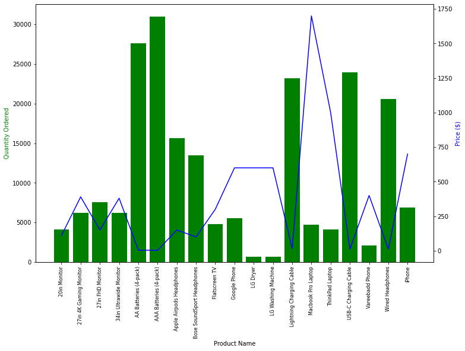

# Electronic Store Sales Data Analysis 

This analysis looks into tech product sales across the US. 

This analysis answers questions like:
  1) Which month is the best for sales?
  2) How much is earned in the top month of sales?
  3) Which city sold the most products?
  4) In what city should the company focus its advertising revenue?
  5) What products are compliments of one another based on being sold together?
  6) Which product generates the most sales? Why?

**RESULTS**

- Sales die at the start of the new year. Slowly grow untill April, where they slow down again untill they shoot back up in Oct, Nov, Dec.
- The cities with the most sales are San Francisco CA and Los Angeles CA. 
- Sales spike mid day and afternoon.
- Phones and their asscessories are the most common products purchased together. 
- Laptops seem to be the most price insensitive product.
